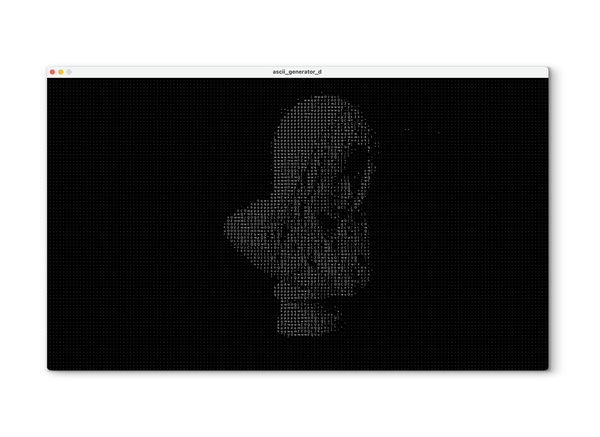

# Processing Playground

---------

## Hello!

Hi!

This repository exists to store my handful of experiments with Processing.

If anyone is reading this, feel free to browse around!

:)

---------

## Requirements

You'll need to have processing installed in order to run any of this. The following
link should prove useful for that:

https://processing.org/download

---------

## Usage

Once installed, this directory can be copied into your processing environment
and the relevant .pde files may then be open and run.

You may also run the projects via the command line by navigating to their
respective directories and running the following command:

```processing-java --sketch=`pwd` --run```

Instructions on using the individual projects can be found within their
respective directories.

---------

## Projects

The projects that currently exist are as follows:

- [Art Generator](art_generator/README.md)

- [ASCII Image Converter](ascii_image_converter/README.md)

- [ASCII Image Converter (Colorful)](ascii_image_converter_colorful/README.md)

- [ASCII Video Converter](ascii_image_converter_colorful/README.md)

- [Letter Mover](letter_mover/README.md)

- [Spiral Generator](spiral_generator/README.md)

---------

## Example Images from Some Projects


