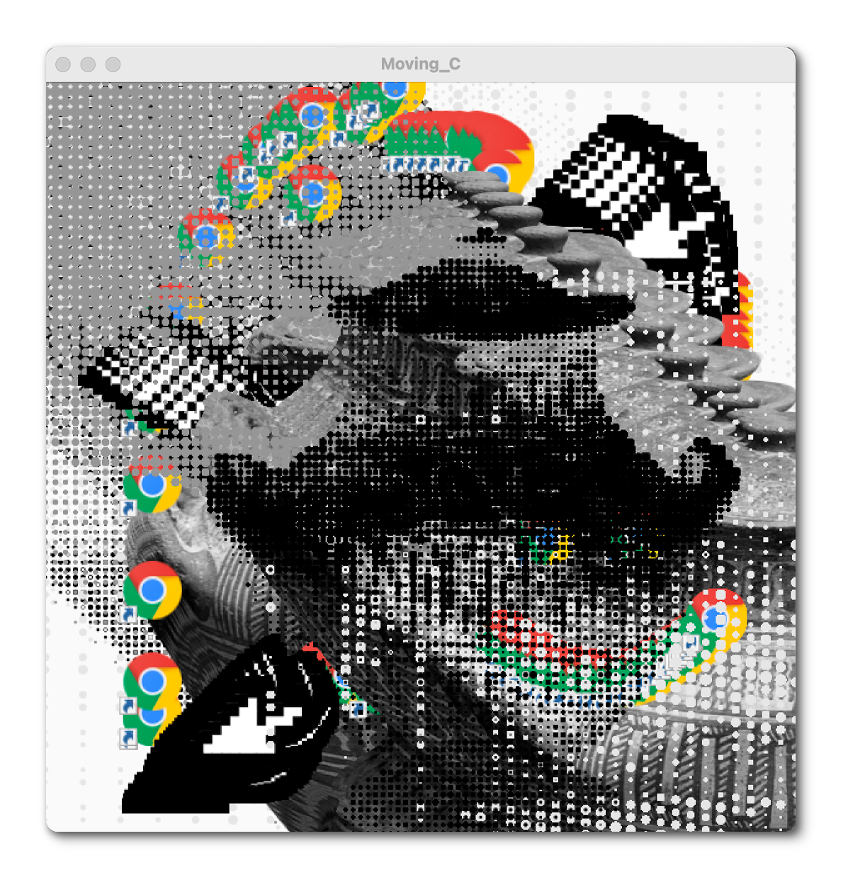

# Processing Art Generator

---------

## Example Images





---------

## Information

### Overview

This generator allows you to move a couple of dot-grid images 
around with the arrow keys, control the way in which 
the motion is saved, and draw on top of it using other images.

### Directions for Usage

The controls are as follows:

```
w, a, s, d - 
    controls directions of motion of the dot-grid image
l - 
    pauses the background refresh until pressed again, 
    if you move while on, allows motion to build up until let go
    re-pressing will have a sort of clearing effect
p - 
    hard pauses drawing loop, if pressed again will un-pause
    if you want to have the mouse-draw picture end on top of the dots,
    use this pause while holding the mouse in the final spot
k - 
    rotates through 3 images to draw with, drawing with the one used in the 
    dot grid
mouse click - 
    draws image at mouse location
```