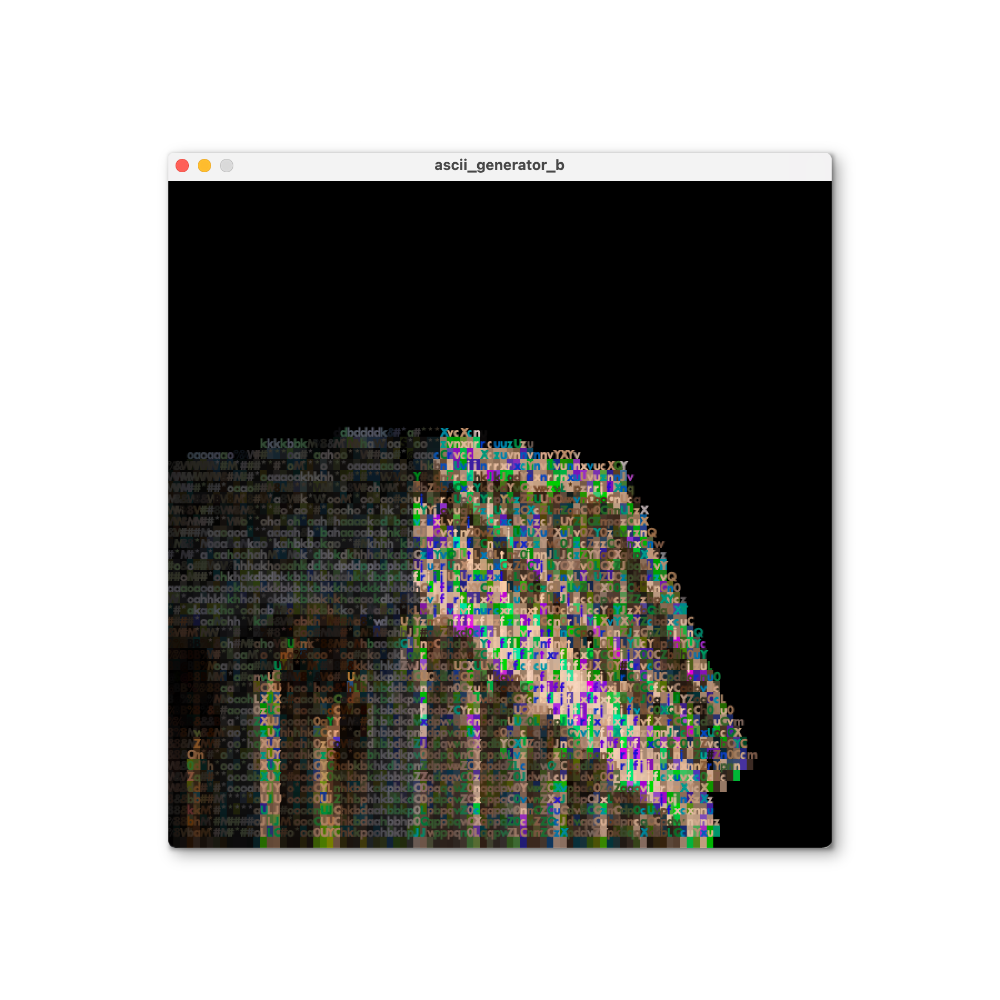

# Processing ASCII Generator

---------

## Example Images




---------

## Ascii Generator A

### Overview

This generator really just allows you to convert an image
to ascii. You can also zoom in to see that it truly is ascii,
since I've made the font small.

### Directions for Usage

The controls are as follows:

```
i - 
    zooms in to 200%
o - 
    zooms in to 50%
```

---------

## Ascii Generator B

### Overview

This generator allows you to convert an image to ascii,
including colored text and highlight. The colors move around every
frame as well, which is fun. You can also zoom in to see that it truly is 
ascii, since I've made the font small.

### Directions for Usage

The controls are as follows:

```
i - 
    zooms in to 200%
o - 
    zooms in to 50%
p - 
    pauses
```

---------

## Ascii Generator C

### Overview

This generator allows you to convert an video to ascii,
including colored text and highlight. The colors move around every
frame as well, which is fun. You can also zoom in to see that it truly is 
ascii, since I've made the font small.

### Directions for Usage

In order to use this, you'll need to move the mov files from ascii_generator/videos into ascii_generator/ascii_generator_c/data.

Once doing so and running, the controls are as follows:

```
i - 
    zooms in to 200%
o - 
    zooms in to 50%
```

---------

## Ascii Generator B

### Overview

This generator allows you to convert an image to ascii,sans colors. 
You can also zoom in to see that it truly is ascii, since I've made the font small.

### Directions for Usage

In order to use this, you'll need to move the mov files from ascii_generator/videos into ascii_generator/ascii_generator_d/data.

Once doing so and running, the controls are as follows:

```
i - 
    zooms in to 200%
o - 
    zooms in to 50%
```